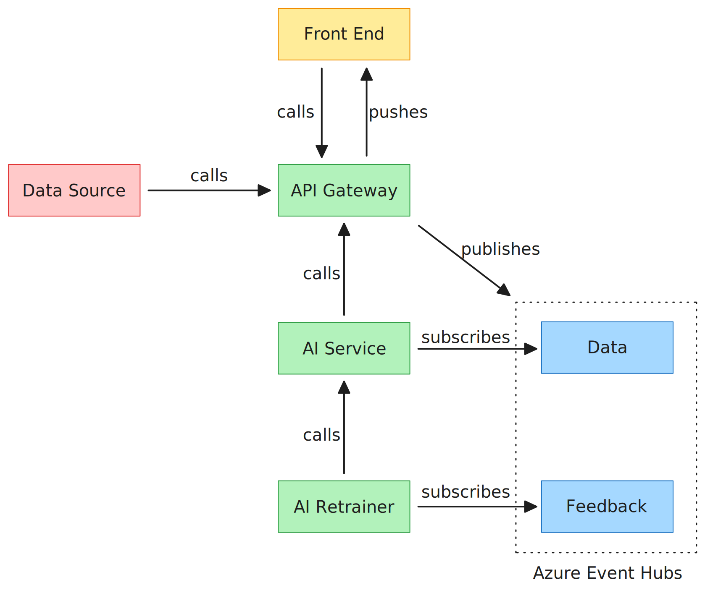
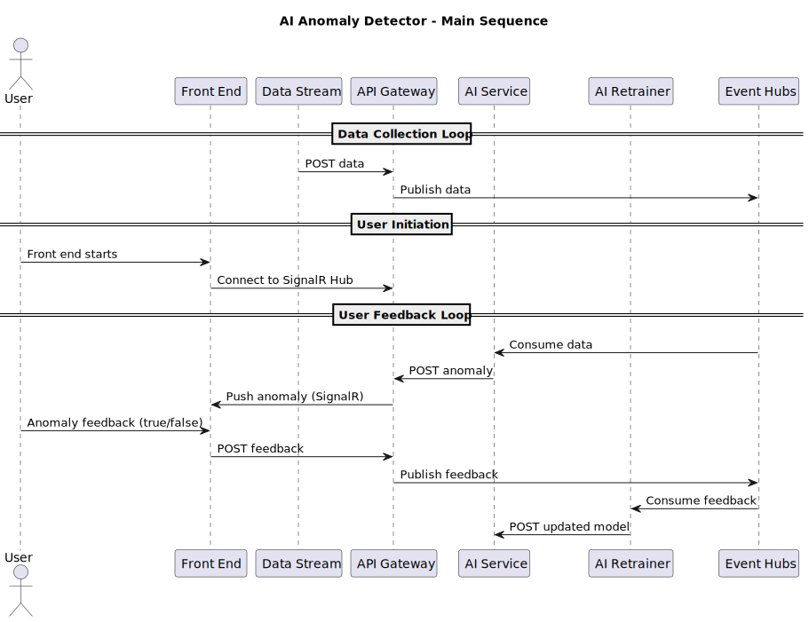
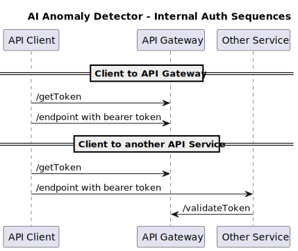

# AI Anomaly Detection System

## Overview

This project is an **AI-powered anomaly detection system** designed to identify unusual patterns in data streams. The system leverages **machine learning techniques** to detect anomalies in real-time, making it applicable to various domains such as **network security, predictive maintenance, and financial fraud detection**.

## Features

- **ASP.NET Core C# and Python FastAPI-powered back-end** for data ingestion and processing
- **Real-time anomaly detection** using AI models
- **React-based dashboard** for monitoring, visualization, and feedback
- **Re-trainable machine learning model** for detection of anomalies in a data stream
- **Microservices architecture** with cloud deployment
- **Event-driven processing** with message queues

## Tech Stack

| Component       | Technology |
|----------------|------------|
| **Back-end**   | C# ASP.NET Core Web API, Python FastAPI, Python AI models (Autoencoder, PyTorch) |
| **Front-end**  | React / TypeScript, ReCharts |
| **Cloud Hosting** | Azure Functions, Web Apps, Event Hubs |

## Architecture

The system follows a **modular microservices architecture**, enabling scalability and flexibility.



For detailed architecture documentation, see: [Architecture Doc](docs/architecture.pdf)

For implementation details and sprint planning, see [Implementation and Sprint Planning Doc](docs/implementation.pdf)

## Process interaction sequences





# System Setup

For help with the Azure command-line interface, see [Azure CLI Cheat Sheet](README-Azure.md)

## Secrets configuration

|Repository secret | Description |
|------------------|-------------|
| AUTHSETTINGS_CLIENTSETTINGS_CLIENT_ID | Client ID for service auth |
| AUTHSETTINGS_CLIENTSETTINGS_CLIENT_SECRET | Client Secret for services auth |
| AUTHSETTINGS_TOKENSETTINGS_KEY | JWT validation secret |
| AZURE_CREDENTIALS | Credentials for access to Azure (see below) |
| GH_PAT | Github Personal Access Token for automatic updates of repository secrets (see below) |

All other secrets (repository and key vault) will be automatically generated on completion of Azure setup and infrastructure deployment.

### Azure Credentials

Create a Service Principal required roles for deployment:

```sh
# Get Subscription ID
SUBSCRIPTION_ID=$(az account show --query id --output tsv)
echo "Using Subscription ID: $SUBSCRIPTION_ID"

# Create Service Principal with Contributor role
SP_JSON=$(az ad sp create-for-rbac --name "anomalydetector-deployment" \
  --role "Contributor" \
  --scopes "/subscriptions/$SUBSCRIPTION_ID" --sdk-auth)

echo "$SP_JSON" > azure_credentials.json

# Extract Service Principal ID
SP_ID=$(echo "$SP_JSON" | jq -r '.clientId')
echo "Service Principal ID: $SP_ID"

# Assign "User Access Administrator" role
az role assignment create \
  --assignee "$SP_ID" \
  --role "User Access Administrator" \
  --scope "/subscriptions/$SUBSCRIPTION_ID"

# Assign "Key Vault Secrets Officer" role 
az role assignment create \
  --assignee "$SP_ID" \
  --role "Key Vault Secrets Officer" \
  --scope "/subscriptions/$SUBSCRIPTION_ID"

# Display the credentials
cat azure_credentials.json
```

Store the credentials in GitHub Secrets as `AZURE_CREDENTIALS`.

### Personal Access Token

Create a PAT so that Azure can update the repository secrets with values generated during deployment:
 
Go to GitHub → Profile → Settings → Developer Settings → Personal Access Tokens → Fine-grained tokens.

Click "Generate New Token".

Set the following permissions:

Contents: Read
Actions: Write
Secrets: Write

Copy the token and store it in GitHub Secrets as `GH_PAT`.

## Deploy the Azure Infrastructure

Run the **Deploy Infrastructure** workflow to provision resources.

## Deploy the Applications

Run the **Deploy All Applications** workflow to deploy all the apps. 

